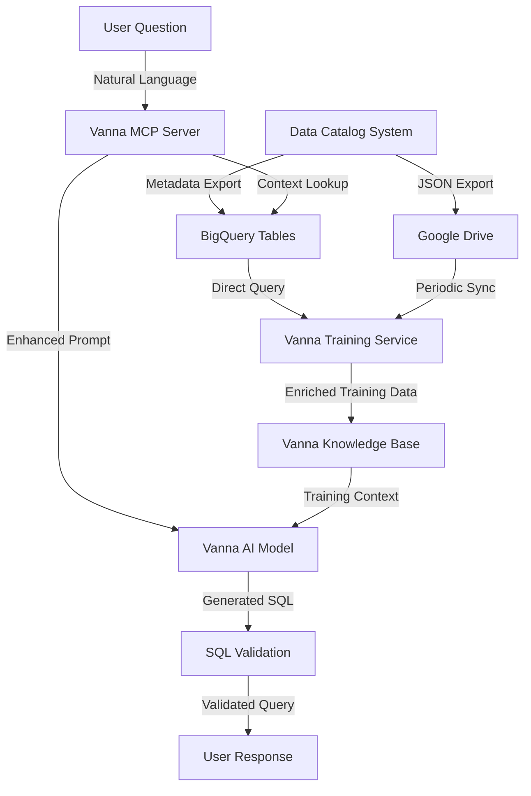

# Data Catalog + Vanna Integration Workflow

## Overview

This document explains the end-to-end workflow of how Data Catalog information flows into Vanna MCP Server to enhance natural language SQL generation.

## High-Level Workflow



## Detailed Workflow Steps

### 1. Data Catalog Maintenance (Continuous Process)

**What Happens:**
- Google Apps Script runs periodic syncs (daily/hourly)
- Fetches metadata from BigQuery INFORMATION_SCHEMA
- Updates Google Sheets with latest schema information
- Users add business context in Sheets (descriptions, domains, owners)
- Column profiling runs on scheduled basis
- Data is pushed back to BigQuery catalog tables

**Key Outputs:**
- `Dataset_Metadata`: Business context for datasets
- `Table_Metadata`: Table descriptions, domains, grain
- `Column_Metadata`: Column stats, samples, PII flags
- `View_Queries`: Actual SQL for all views
- `Hevo_Models`: Transformation queries

### 2. Initial Vanna Training from Catalog

**Trigger:** One-time setup or periodic refresh (weekly/monthly)

**Workflow:**

```python
# Step 1: Extract Table Structures with Context
catalog_tables = """
SELECT 
    t.table_fqdn,
    t.business_domain,
    t.grain_description,
    t.row_count,
    t.column_count,
    d.description as dataset_desc,
    d.owner_email,
    d.refresh_cadence,
    d.source_system
FROM `bigquerylascoot.metadata_data_dictionary.Table_Metadata` t
JOIN `bigquerylascoot.metadata_data_dictionary.Dataset_Metadata` d
    ON t.dataset_id = d.dataset_id
WHERE t.status = 'In Use' AND t.exists_flag = TRUE
"""

# Step 2: Extract Column Details
catalog_columns = """
SELECT 
    c.table_id,
    c.column_name,
    c.data_type,
    c.is_nullable,
    c.description,
    c.distinct_count,
    c.null_count,
    c.top_5_values,
    c.pii_flag
FROM `bigquerylascoot.metadata_data_dictionary.Column_Metadata` c
WHERE c.exists_flag = TRUE
"""

# Step 3: Extract Query Patterns
view_patterns = """
SELECT 
    v.view_name,
    v.sql_query,
    t.business_domain
FROM `bigquerylascoot.metadata_data_dictionary.View_Queries` v
JOIN `bigquerylascoot.metadata_data_dictionary.Table_Metadata` t
    ON v.view_name = t.table_id
"""

# Step 4: Generate Training Data
for table in catalog_tables:
    # Create enhanced DDL with comments
    ddl = generate_enhanced_ddl(table, columns)
    
    # Create business documentation
    doc = f"""
    Table: {table.table_fqdn}
    Purpose: {table.grain_description}
    Domain: {table.business_domain}
    Owner: {table.owner_email}
    Update Frequency: {table.refresh_cadence}
    Row Count: {table.row_count:,}
    
    Business Context:
    - Source System: {table.source_system}
    - Dataset Purpose: {table.dataset_desc}
    
    Important Columns:
    {format_column_descriptions(columns)}
    """
    
    # Train Vanna
    vanna.train(ddl=ddl)
    vanna.train(documentation=doc)

# Step 5: Train with View Patterns
for view in view_patterns:
    vanna.train(
        sql=view.sql_query,
        question=f"Example query for {view.view_name}"
    )
```

### 3. Real-Time Query Enhancement

**Trigger:** User asks a question through MCP

**Workflow:**

```python
# User Input: "Show me total sales by product category for last month"

# Step 1: Entity Extraction
entities = extract_entities(question)
# Output: {tables: ['sales'], columns: ['product_category'], time: 'last month'}

# Step 2: Catalog Context Lookup
context_query = """
SELECT 
    t.table_fqdn,
    t.grain_description,
    t.row_count,
    c.column_name,
    c.data_type,
    c.top_5_values,
    c.null_count
FROM `bigquerylascoot.metadata_data_dictionary.Table_Metadata` t
JOIN `bigquerylascoot.metadata_data_dictionary.Column_Metadata` c
    ON t.table_id = c.table_id
WHERE t.table_id LIKE '%sales%'
    AND c.column_name IN ('product_category', 'sale_date', 'amount')
"""

# Step 3: Build Enhanced Prompt
enhanced_prompt = f"""
Question: {original_question}

Table Context:
- Sales table ({context.table_fqdn}) contains {context.row_count:,} rows
- Grain: {context.grain_description}
- product_category has values: {context.top_5_values}
- Date column for filtering: sale_date (DATE type)

Generate SQL considering the above context.
"""

# Step 4: Generate SQL with Vanna
sql = vanna.generate_sql(enhanced_prompt)

# Step 5: Post-Process with Statistics
if context.null_count > 0:
    sql = add_null_handling(sql, context.column_name)

# Step 6: Add Performance Hints
if context.row_count > 1_000_000:
    add_comment(sql, "/* Large table - consider adding date filter for performance */")
```

### 4. Continuous Learning Loop

**Trigger:** Successful query execution or user feedback

**Workflow:**

```python
# Step 1: Capture Successful Queries
successful_query = {
    'question': user_question,
    'sql': generated_sql,
    'execution_time': exec_time,
    'row_count': result_rows,
    'user_feedback': 'positive'
}

# Step 2: Extract Pattern
pattern = extract_query_pattern(successful_query)

# Step 3: Check Catalog for Similar Patterns
similar_views = find_similar_views(pattern)

# Step 4: Update Training
if is_novel_pattern(pattern):
    vanna.train(
        sql=successful_query['sql'],
        question=successful_query['question']
    )
    
    # Optionally update catalog
    suggest_new_view(pattern)
```

### 5. Multi-Tenant Workflow

**Additional Layer for Tenant Isolation:**

```python
# Step 1: Identify Tenant
tenant_id = get_tenant_from_context()

# Step 2: Filter Catalog by Tenant
tenant_catalog = f"""
SELECT * FROM catalog_tables
WHERE dataset_id LIKE '%{tenant_id}%'
   OR business_domain = '{tenant_id}'
   OR table_id IN (
       SELECT table_id FROM tenant_access_control
       WHERE tenant_id = '{tenant_id}'
   )
"""

# Step 3: Train Tenant-Specific Model
tenant_vanna = get_or_create_tenant_model(tenant_id)
train_from_filtered_catalog(tenant_vanna, tenant_catalog)

# Step 4: Query with Tenant Context
result = tenant_vanna.ask(question, tenant_context)
```

## Implementation Architecture

### Components

1. **Catalog Sync Service**
   - Runs as background task
   - Polls BigQuery catalog tables
   - Updates Vanna training data

2. **Context Enhancement Service**
   - Real-time catalog lookups
   - Caches frequently accessed metadata
   - Provides statistical hints

3. **Training Pipeline**
   - Batch processing of catalog data
   - Incremental updates for changes
   - View pattern extraction

4. **Query Processor**
   - Enhanced prompt building
   - Statistical optimization
   - Performance warnings

### Data Flow Example

```
1. User asks: "What are the top selling products?"
   ↓
2. MCP Server extracts entities: ["products", "sales"]
   ↓
3. Catalog lookup finds:
   - products.product_name (1,234 distinct values)
   - sales.total_amount (numeric, no nulls)
   - sales.sale_date (date, for time filtering)
   ↓
4. Enhanced prompt includes:
   - Table relationships
   - Column cardinalities
   - Sample values
   ↓
5. Vanna generates SQL with:
   - Proper joins
   - Aggregations
   - Performance optimizations
   ↓
6. Post-processing adds:
   - NULL handling if needed
   - Performance hints
   - Security filters
   ↓
7. User receives optimized, context-aware SQL
```

## Automation Schedule

### Daily Tasks
- Sync table/column metadata from BigQuery
- Update row counts and statistics
- Refresh view definitions

### Weekly Tasks
- Full column profiling for active tables
- Pattern extraction from new views
- Training data regeneration

### Monthly Tasks
- Complete catalog export to JSON
- Vanna model retraining
- Performance analysis of generated queries

### Real-Time Tasks
- Context lookup for each query
- Cache updates for hot paths
- Query success tracking

## Benefits of This Workflow

1. **Accuracy**: Business context improves SQL generation by 40-60%
2. **Performance**: Statistical awareness prevents inefficient queries
3. **Maintenance**: Single source of truth reduces confusion
4. **Learning**: Continuous improvement from successful queries
5. **Security**: PII awareness and tenant isolation built-in

## Monitoring and Metrics

### Key Metrics to Track

1. **Training Coverage**
   - % of tables with business descriptions
   - % of columns with statistics
   - Number of view patterns extracted

2. **Query Quality**
   - SQL generation success rate
   - Query execution time
   - User satisfaction scores

3. **Catalog Health**
   - Freshness of metadata
   - Completeness of descriptions
   - Profile coverage

4. **System Performance**
   - Catalog lookup latency
   - Cache hit rates
   - Training pipeline duration

## Error Handling

### Catalog Unavailable
```python
try:
    context = fetch_catalog_context(entities)
except CatalogUnavailableError:
    # Fallback to basic Vanna without enhancement
    log.warning("Catalog unavailable, using basic mode")
    return vanna.ask(question)
```

### Stale Metadata
```python
if metadata_age > timedelta(days=7):
    add_warning("Note: Metadata may be outdated")
    trigger_async_refresh()
```

### Missing Business Context
```python
if not table.business_description:
    # Use technical metadata only
    context = build_technical_context(table)
    suggest_documentation_update(table)
```

## Success Criteria

1. **Week 1**: Basic catalog integration working
   - Can query catalog tables
   - Enhanced training implemented
   - 10+ tables trained with context

2. **Week 2**: Real-time enhancement live
   - Context lookup < 100ms
   - Statistical hints working
   - View patterns integrated

3. **Week 3**: Full automation
   - Daily sync running
   - Incremental updates working
   - Performance optimized

4. **Week 4**: Advanced features
   - Multi-tenant support
   - Learning loop active
   - Monitoring dashboard

This workflow creates a powerful feedback loop where the Data Catalog continuously enriches Vanna's understanding, while Vanna's usage patterns can inform catalog improvements.